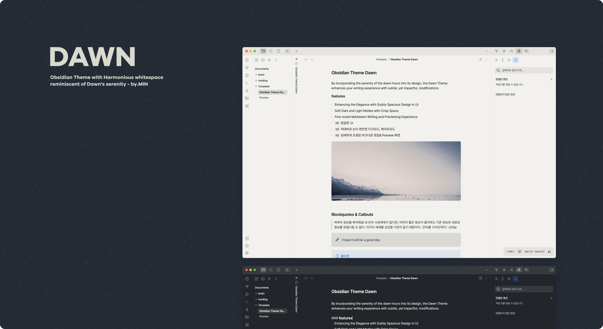
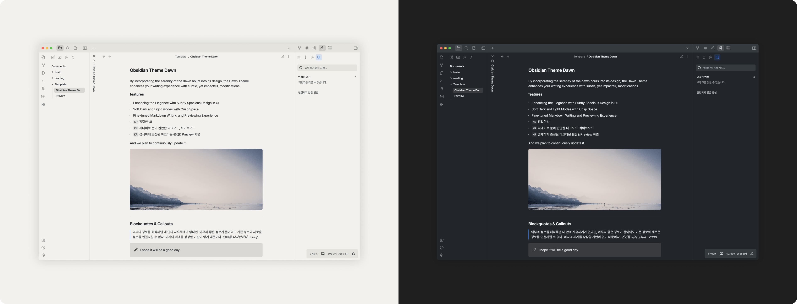
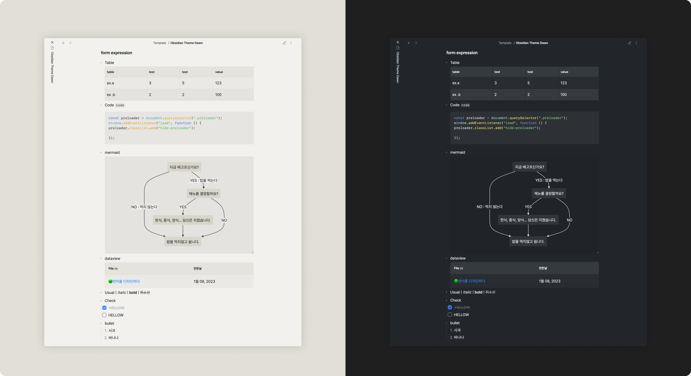
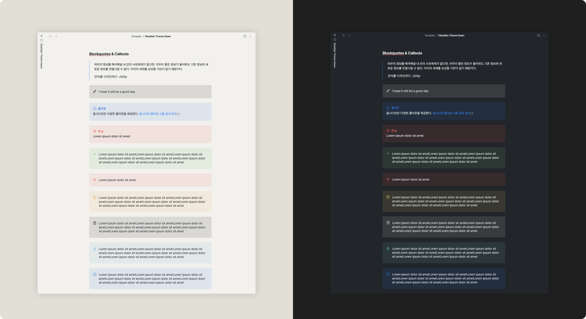

# Dawn

By incorporating the serenity of the dawn hours into its design, the Dawn Theme enhances your writing experience with subtle, yet impactful, modifications.

## features

- Enhancing the Elegance with Subtly Spacious Design in UI
- Soft Dark and Light Modes with Crisp Space
- Fine-tuned Markdown Writing and Previewing Experience

And we plan to continuously update it.

## Color

I personally have a preference for high-contrast modes, but for the initial version, pure white (#FFFFFF) and black (#000000) were intentionally excluded in the creation of design tokens.

_In the initial version, we aimed to primarily capture the serenity of Dawn. If the opportunity arises, I would like to try making a high-contrast mode that captures the immersive feeling of dawn._

Even with low contrast, the theme was created with consideration for readability and accessibility. (It's not perfect though).

## Document

**form**

**Blockquotes & Callouts**

With Obsidian, you can create beautiful notes using various markdown options.

Fine-tune the design with detailed customization for better formatting.

Make this part more stunning with feedback, please!

## To-Do

- [ ] Mobile View
- [ ] Plug-in support
  - [ ] More Dataviews
  - [ ] Canvas
- [ ] Cleanup CSS

## LICENSE

You can freely change or suggest😁
