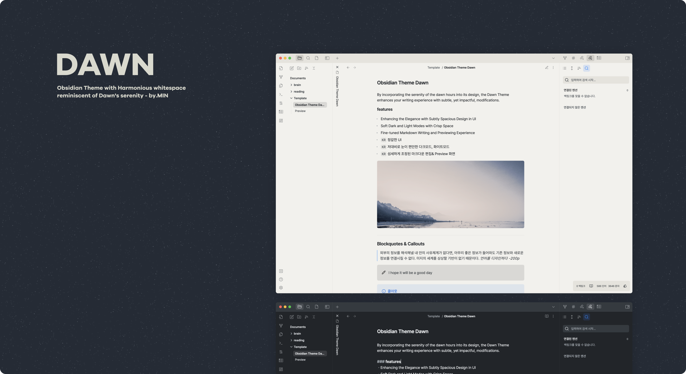
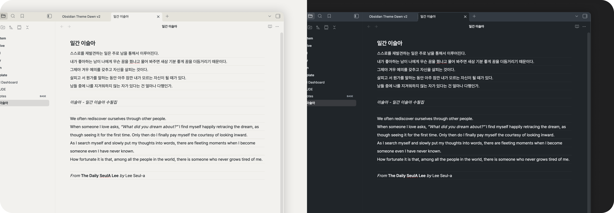
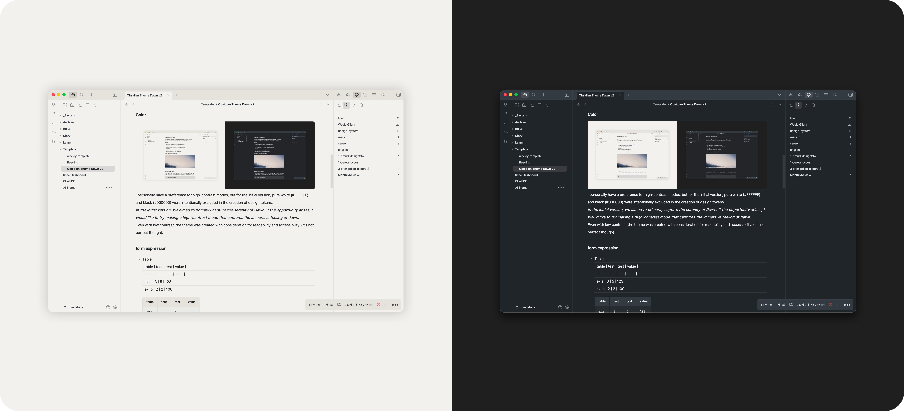
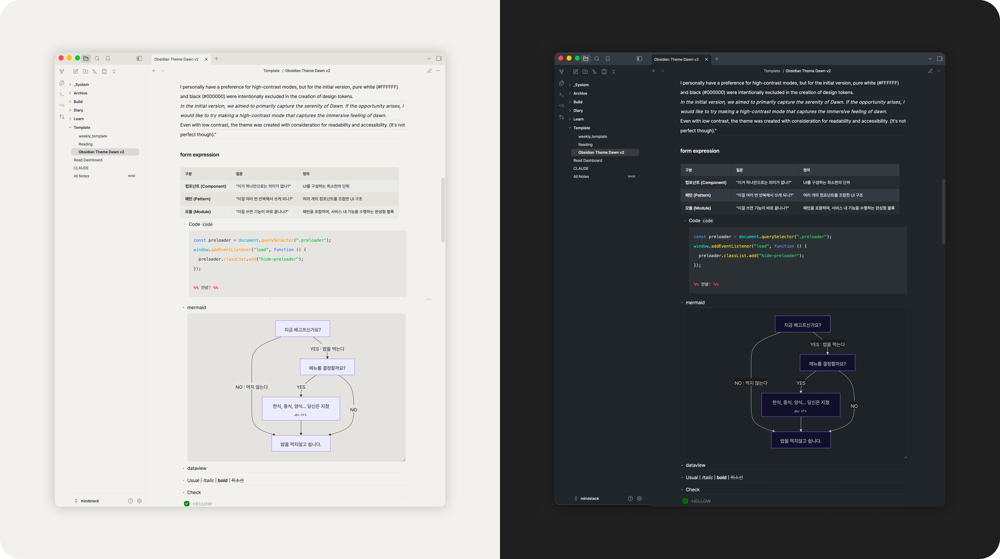
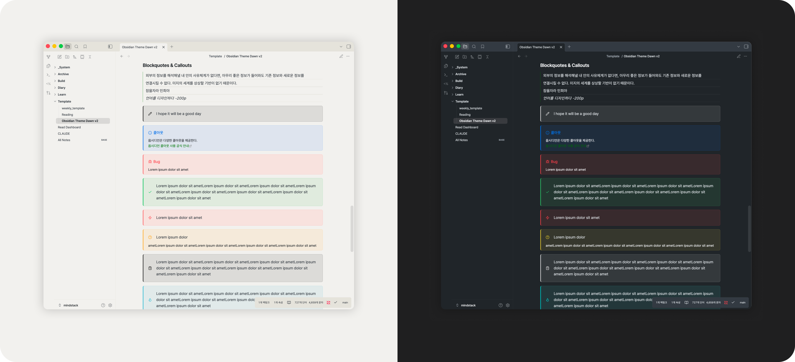

# Dawn-v2

By incorporating the serenity of the dawn hours into its design, the Dawn Theme enhances your writing experience with subtle, yet impactful, modifications.

**v2** keeps the same dawn-quiet base and adds a paper-notebook feel — ruled lines and an analog texture, a design direction drawn from [anzi's note-format post](https://blog.anzi.kr/record/72).

`KR` v2는 기존 '새벽의 고요함' 컨셉에 공책·노트·아날로그 감성을 더한 버전입니다. anzi 님의 [노트 포맷 글](https://blog.anzi.kr/record/72)에서 디자인 영감을 받아 반영했습니다.

## features

- Enhancing the Elegance with Subtly Spacious Design in UI
- Soft Dark and Light Modes with Crisp Space
- Fine-tuned Markdown Writing and Previewing Experience
- Analog, note-like paper design `new` — inspired by [anzi](https://blog.anzi.kr/record/72)
- `KR` 정갈한 UI
- `KR` 저대비로 눈이 편안한 다크모드, 화이트모드
- `KR` 섬세하게 조정된 마크다운 편집& Preview 화면
- `KR` 아날로그 감성의 노트 디자인 반영 `new` — 디자인 영감 [anzi](https://blog.anzi.kr/record/72)

Beyond that, design details were tuned to keep up with Obsidian's updates.

`KR` 그 외 옵시디언 업데이트에 맞추어 세부적인 디자인 디테일을 조정했습니다.

And we plan to continuously update it.

## Color

I personally have a preference for high-contrast modes, but for the initial version, pure white (#FFFFFF) and black (#000000) were intentionally excluded in the creation of design tokens.

_In the initial version, we aimed to primarily capture the serenity of Dawn. If the opportunity arises, I would like to try making a high-contrast mode that captures the immersive feeling of dawn._

Even with low contrast, the theme was created with consideration for readability and accessibility. (It's not perfect though).

## Document

**form**

**Blockquotes & Callouts**

With Obsidian, you can create beautiful notes using various markdown options.

Fine-tune the design with detailed customization for better formatting.

Make this part more stunning with feedback, please!

## LICENSE

You can freely change or suggest😁
